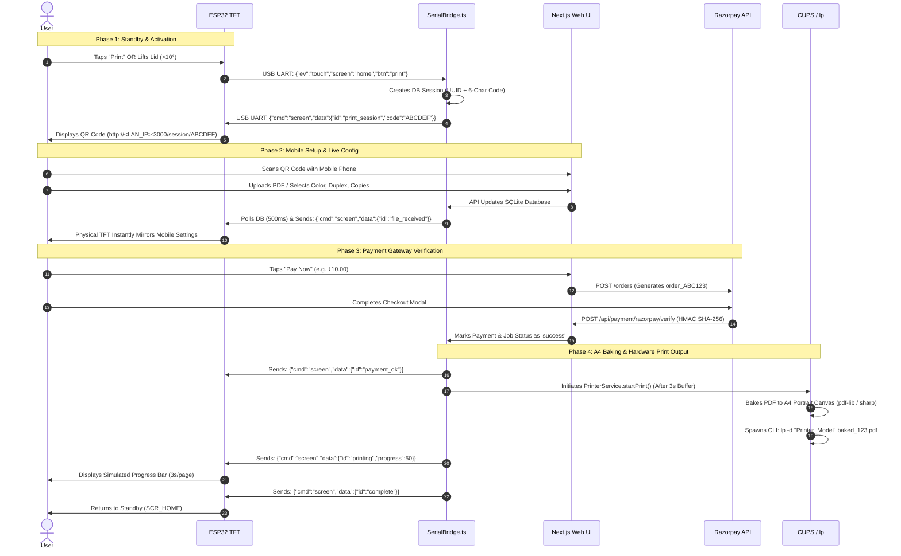

<div align="center">
  

  <!-- Shields.io Badges -->
  <p align="center">
    <a href="https://nextjs.org/"></a>
    <a href="https://www.typescriptlang.org/"></a>
    <a href="https://www.sqlite.org/"></a>
    <a href="https://www.espressif.com/en/products/socs/esp32"></a>
    <a href="https://razorpay.com/"></a>
    <a href="https://opensource.org/licenses/MIT"></a>
  </p>

  <p align="center">
    <b>A premium, enterprise-grade hardware-software bridge powering fully automated self-service printing, eSCL scanning, dynamic PDF baking, and touch-screen kiosks with ultra-sensitive MPU-6050 tamper detection.</b>
  </p>
  
  <p align="center">
    <a href="#-project-overview">Overview</a> •
    <a href="#-features--internal-mechanics">Features</a> •
    <a href="#-system-architecture--communication">Architecture</a> •
    <a href="#-user-flow-scan--qr--web--pay--print">User Flow</a> •
    <a href="#-beginner-friendly-user-setup-guide">Setup Guide</a> •
    <a href="#-ai-assisted-hardware-configuration">AI Config</a> •
    <a href="#-api--websocket-documentation">API Docs</a>
  </p>
</div>

---

## 🌟 Project Overview

**SmartPrint Station** is a comprehensive, production-ready ecosystem designed to convert standard consumer or enterprise printers and scanners into fully self-service, monetized kiosks.

Combining a **Next.js 16 Backend**, a **Custom WebSockets & USB UART Bridge**, native **CUPS (`lp`/`lpoptions`) Driver Management**, network **eSCL XML Scanning**, and an **ESP32 Touch TFT Display** running an onboard **MPU-6050 Accelerometer**, this project delivers an incredibly smooth, visually spectacular, and highly secure user experience.

```
       [ 📱 Mobile App / User UI ] ──(WiFi / HTTP / Razorpay)──► [ 💻 Next.js Master Server ]
                                                                       │       │
      [ 🖨️ CUPS Printer Daemon ] ◄──(lp / lpoptions CLI)───────────────┤       ├─(USB UART / 115200)──► [ 🖥️ ESP32 TFT + MPU ]
                                                                       │
      [ 📠 eSCL Network Scanner] ◄──(HTTP XML / Port 80)───────────────┘
```

---

## ✨ Features & Internal Mechanics

Every feature documented below reflects the **exact active implementation** within the codebase:

### 🎮 Dual-Activation Scan Mode (Touch & Lid Open Auto-Start)
- **Mechanics**: The ESP32 firmware (`esp32_kiosk.ino`) continuously monitors the physical scanner lid angle using the MPU-6050 accelerometer. When the kiosk is on the Home Screen (`SCR_HOME`), users can either tap the **Scan** button on the touch display OR simply walk up and open the physical scanner lid. If `sData.lidAngle > 10.0f`, the ESP32 instantly sends `{"ev":"touch","screen":"home","btn":"scan_open"}` to the master server, automatically starting the scan flow!

### 🛡️ Ultra-Sensitive Tamper Detection (Baseline Calibration Fix)
- **Mechanics**: Real-world MPU-6050 sensors exhibit fixed factory zero-g offset errors. During `mpu_init()` in `mpu_handler.cpp`, the firmware samples the accelerometer 100 times to calculate `baseAX`, `baseAY`, and `baseAZ`. It establishes an exact resting baseline magnitude (`baseMag = sqrtf(baseAX² + baseAY² + baseAZ²)`). In the main loop, `deviation = abs(mag - baseMag)` is compared against `TAMPER_THRESHOLD` (`0.50f`). When resting, `deviation` is practically `0.00 m/s²` (eliminating false alarms), but instantly triggers on physical bumps, hits, or sliding motions.
- **Synthesizer Alarm**: Upon receiving a tamper event over USB UART, `SerialBridge.ts` broadcasts a live WebSocket alert (`channel: 'hardware'`). The Next.js Admin Dashboard (`AdminTamperModal.tsx`) intercepts this and triggers a Web Audio API synthesizer outputting a piercing `2500Hz` pulsed square wave (`BEEP BEEP BEEP`) alongside a full-screen flashing visual alarm.

### 🔀 Selective Tamper Bypass (Lid Open & Error Exclusions)
- **Mechanics**: To ensure users can safely open the scanner lid or refill paper without sounding the security alarm, `esp32_kiosk.ino` wraps `mpu_check_tamper()` in a strict exclusion block. Tamper detection is fully active during standby/idle states but is completely bypassed on `SCR_SCAN_*` screens and the `SCR_OUT_OF_PAPER` screen.

### 🥧 A4 Portrait PDF Baking & EXIF Normalization
- **Mechanics**: In `PrinterService.ts`, before sending files to the CUPS spooler, `bakePrintFile()` normalizes arbitrary uploads. Using `pdf-lib` and `sharp`, it creates an exact A4 Portrait canvas (`595.28 x 841.89` pt). Images are auto-oriented based on EXIF tags, converted to high-quality JPEGs, and mathematically scaled (supporting **Fit** or **Fill** aspect ratio rules). Landscape documents are embedded with a perfect 90-degree rotation (`degrees(90)`), ensuring flawless, edge-to-edge hardware print output.

### 🔄 Global TFT Error Sync & Out of Paper Handling
- **Mechanics**: `PrinterService.syncRealStatus()` executes `lpoptions -p "<model>"` every 500ms to poll real-time CUPS `printer-state-reasons`. If `media-empty` or `tray-missing` is detected, `current_error` is set to `Paper Tray 1 not detected`. `SerialBridge.syncState()` evaluates this globally (even when no active job exists) and instantly locks the TFT onto `SCR_OUT_OF_PAPER`, displaying a premium warning triangle and refund notice: `Your money has been refunded to your original payment method. We are sorry.`

### 🔴 Physical Home Button Emergency Exit
- **Mechanics**: Pressing the physical button on the kiosk casing transmits `{"ev":"button","btn":"home"}` over USB. `SerialBridge` intercepts this packet, clears the active backend error state (`current_error: null`), marks active database sessions as `cancelled`, and forces the TFT display back to `SCR_HOME`.

### 📑 Collect Document Hardware Lock
- **Mechanics**: Following an eSCL scan, `SerialBridge` transmits `{"cmd":"scan_reminder","data":true}` to the ESP32. The TFT locks onto `SCR_SCAN_COLLECT` ("Please collect your original document"). The ESP32 requires the user to open the lid past 10 degrees (`sData.lidAngle > 10.0f`) and close it back (`sData.lidAngle < 3.0f`) before transmitting `btn === 'scan_collect_done'` to unlock the QR session screen.

### 🌐 Network eSCL Scanning Engine
- **Mechanics**: `ScannerService.ts` transmits raw XML control schemas via HTTP POST to `http://<PRINTER_IP>/eSCL/ScanJobs`, parses `Location` headers, polls `/eSCL/ScannerStatus` until complete, downloads the raw `NextDocument` JPEG buffer, and compiles multi-page scans into a unified `scan_<id>.pdf`.

---

## 🛠️ Tech Stack & Dependencies

<div align="center">

| Layer | Technology | Version | Key Purpose |
| :--- | :--- | :--- | :--- |
| **Framework** | [Next.js](https://nextjs.org/) | `16.2.9` | Server-side rendering, API routing, and React rendering engine |
| **Runtime** | [TypeScript](https://www.typescriptlang.org/) | `^5.0` | Strict type safety across backend and hardware integration layers |
| **Database** | [SQLite (better-sqlite3)](https://github.com/WiseLibs/better-sqlite3) | `^12.11.1` | High-performance, synchronous database running in WAL mode |
| **Hardware Bridge**| [SerialPort](https://serialport.io/) | `^13.0.0` | USB UART binding communicating with ESP32 at `115200` baud |
| **Real-time API** | [WS (WebSockets)](https://github.com/websockets/ws) | `^8.21.0` | Raw WebSocket server upgrading HTTP requests on `/ws` |
| **Document Engine**| [PDF-Lib](https://pdf-lib.js.org/) | `^1.17.1` | Advanced PDF editing, rotation, embedding, and A4 canvas generation |
| **Image Processing**| [Sharp](https://sharp.pixelplumbing.com/) | `^0.35.2` | High-speed EXIF auto-orientation and JPEG normalization |
| **Payment Gateway**| [Razorpay API](https://razorpay.com/) | REST API | Order creation and HMAC SHA-256 payment signature verification |
| **Firmware** | [C++ / ESP32 Arduino](https://www.espressif.com/) | v2.0+ | ESP32 touch display drivers, MPU-6050 angles, and JSON serial parser |

</div>

---

## 🏗️ System Architecture & Communication

The ecosystem operates on a **Hybrid Event-Driven & Polling Master-Proxy Architecture**. The custom HTTP master server (`server.ts`) intercepts hardware routes to prevent USB port conflicts across Next.js worker threads.

```mermaid
graph TD
    subgraph Master Server [Laptop / Master HTTP Server: server.ts]
        Next[Next.js Web Engine]
        WSS[WebSocket Server: /ws]
        SB[SerialBridge.ts: Master State Hub]
        DB[(SQLite: kiosk.db)]
        PS[PrinterService.ts]
        SS[ScannerService.ts]
    end

    subgraph Hardware Layer
        ESP[ESP32 Hardware Kiosk: TFT + MPU-6050]
        CUPS[CUPS Printer Daemon: lp / lpoptions]
        eSCL[eSCL Network Scanner: Port 80]
    end

    subgraph Client Layer
        Mobile[User Mobile Phone: Web UI]
        Admin[Admin Web Dashboard]
    end

    %% Internal Connections
    Next -->|Reads/Writes| DB
    SB -->|Polls 500ms| DB
    SB -->|Broadcasts Hardware Events| WSS
    PS -->|Reads/Writes| DB
    SS -->|Reads/Writes| DB

    %% External Connections
    Mobile -->|HTTP / API Requests| Next
    Admin -->|WebSocket Subscriptions| WSS
    SB <-->|USB UART / 115200 Baud| ESP
    PS -->|Spawns CLI Commands| CUPS
    SS -->|HTTP POST XML Schemas| eSCL

    classDef master fill:#0f172a,stroke:#3b82f6,stroke-width:2px,color:#fff;
    classDef hardware fill:#7f1d1d,stroke:#ef4444,stroke-width:2px,color:#fff;
    classDef client fill:#14532d,stroke:#22c55e,stroke-width:2px,color:#fff;
    
    class Master Server master;
    class Hardware Layer hardware;
    class Client Layer client;
```

---

## 📁 Folder Structure

```
print-kiosk/
├── .env.example             # Dummy environment variables for system config
├── .gitignore               # Security exclusions (node_modules, kiosk.db, keys)
├── package.json             # Node dependencies and execution scripts (tsx server.ts)
├── server.ts                # Master custom HTTP server & WebSocket engine
├── tsconfig.json            # TypeScript compiler configuration
├── kiosk.db                 # SQLite production database (WAL mode)
│
├── hardware/                # Microcontroller Firmware
│   ├── esp32_kiosk/         # ESP32 Touch TFT & MPU-6050 Kiosk Project
│   │   ├── esp32_kiosk.ino  # Main loop, lid automation, and screen controller
│   │   ├── config.h         # Pins, TAMPER_THRESHOLD (0.50f), and constants
│   │   ├── mpu_handler.cpp  # Baseline calibration & magnitude deviation logic
│   │   ├── screens.cpp      # TFT UI graphics and layout rendering routines
│   │   ├── serial_comm.cpp  # UART JSON command receiver and transmitter
│   │   └── touch_handler.cpp# Touch coordinate and physical button parser
│   └── calibrator/          # Standalone MPU calibration sketch
│
├── scripts/
│   └── process_id_card.py   # Python script for ID card auto-alignment
│
└── src/
    ├── app/                 # Next.js App Router (Web Pages & API Endpoints)
    │   ├── admin/           # Admin Dashboard UI (Dashboard, Events, History, Paper)
    │   ├── api/             # REST APIs (Hardware, Payment, Print, Scan, Sessions)
    │   ├── session/         # Mobile User UI (QR Session Landing, Live Config)
    │   └── globals.css      # Tailwind CSS global styles
    │
    ├── components/          # React Components (AdminTamperModal, HardwareConnection)
    ├── hooks/               # Custom React Hooks (useWebSocket)
    ├── lib/                 # Utilities (db.ts, db-schema.ts, pdf-analyzer.ts, pricing.ts)
    ├── services/            # Core Backend Logic (SerialBridge, PrinterService, Payment)
    └── types/               # TypeScript Interface Definitions
```

---

## 🛣️ User Flow: Scan → QR → Web → Pay → Print



---

## 🚀 Beginner-Friendly User Setup Guide

Follow this step-by-step guide to configure and run **SmartPrint Station** on your own physical printer, scanner, and laptop!

### 📦 1. Required Hardware
1. **Laptop / Master Server**: Mac, Linux, or Windows (Mac/Linux highly recommended for native CUPS support).
2. **ESP32 Development Board**: Connected to a Touch TFT display (e.g., ILI9341 / ST7789) and an MPU-6050 Accelerometer.
3. **Printer**: Any USB or Network printer supporting CUPS (e.g., HP LaserJet, Brother, Canon).
4. **Scanner**: Any Network Scanner supporting the **HP eSCL protocol** (most modern Wi-Fi all-in-one printers support this out of the box).
5. **Cables**: High-quality USB data cable for connecting the ESP32 to your laptop.

---

### 🖨️ 2. Finding Your Printer Name & Scanner IP

#### Finding the Printer Name (Mac / Linux)
Open your terminal and run the following command to list all configured CUPS printers:
```bash
lpstat -p
```
*Look for the exact printer name (e.g., `printer HP_LaserJet_Pro_MFP_M28w is idle`). Copy `HP_LaserJet_Pro_MFP_M28w` exactly as shown.*

#### Finding the Scanner IP
Ensure your Wi-Fi scanner is connected to the same local network as your laptop. Find its IP address via your router dashboard or printer display screen (e.g., `192.168.1.100`). To verify eSCL support, open your web browser and navigate to:
```
http://192.168.1.100/eSCL/ScannerStatus
```
*If you see an XML page displaying `<pwg:State>Idle</pwg:State>`, your scanner is fully compatible!*

---

### ⚙️ 3. Configuring Your `.env` File
In the root directory of the project, copy the example environment file:
```bash
cp .env.example .env.local
```
Open `.env.local` in your favorite text editor and update the following parameters:
```env
# Server Binding
PORT=3000
HOSTNAME=0.0.0.0
NODE_ENV=development

# Razorpay Keys (Create a test account at razorpay.com to get these)
RAZORPAY_KEY_ID=rzp_test_your_key_id
RAZORPAY_KEY_SECRET=your_key_secret

# Hardware Setup
PRINTER_IP=192.168.1.100
PRINTER_NAME=HP_LaserJet_Pro_MFP_M28w
SERIAL_PORT=/dev/cu.usbserial-0001
ESP32_BAUDRATE=115200

# Security
SESSION_SECRET=your_secure_random_string_here
DATABASE_URL=file:./kiosk.db
```

---

### 🔌 4. Flashing & Connecting the ESP32 TFT
1. Install the [Arduino IDE](https://www.arduino.cc/en/software) or Visual Studio Code with PlatformIO.
2. Install the required ESP32 board libraries and display drivers (e.g., `TFT_eSPI`, `Adafruit_MPU6050`).
3. Open `hardware/esp32_kiosk/esp32_kiosk.ino`.
4. Connect your ESP32 to your laptop via USB. Select your specific board and COM port (`/dev/cu.usbserial-0001` or `COM3`).
5. Click **Upload**. Once complete, the TFT display should boot up and show the Home Screen (`SCR_HOME`).

---

### 💻 5. Starting the Master Backend & Frontend
Open your terminal, navigate to the project root directory, and install the Node.js dependencies:
```bash
npm install
```
Start the master custom HTTP server and Next.js engine:
```bash
npm run dev
```
*The terminal will display `> Ready on http://<YOUR_LAN_IP>:3000`. The custom `server.ts` engine will automatically launch the WebSocket server on `/ws` and initialize `SerialBridge.ts` to bind with your ESP32 over USB!*

---

### 🧪 6. Testing Scanning & Printing

#### Testing Scanning
1. Open the physical scanner lid on your kiosk. The MPU-6050 will detect the angle change (`> 10°`) and automatically transition the TFT to `SCR_SCAN_PLACE_DOC`.
2. Place a document on the scanner glass and close the lid.
3. The TFT will display `SCR_SCANNING`. The backend will issue an eSCL XML POST request to your scanner IP, download the scan, compile `scan_1.pdf`, and display the `SCR_SCAN_COLLECT` reminder screen!

#### Testing Printing
1. Open `http://localhost:3000/admin` in your web browser.
2. Under the **Hardware Connections** tab, verify your printer model is listed as **Online**.
3. Click **Test Print**. The backend will generate a dummy test PDF, bake it into an A4 canvas (`PrinterService.bakePrintFile`), and dispatch it to your physical printer via `lp`!

---

## 🤖 AI-Assisted Hardware Configuration

Every printing and scanning setup has unique characteristics—from specific USB UART serial port paths (`/dev/ttyUSB0`, `COM4`, `/dev/cu.usbmodem1234`) to custom CUPS driver flags and Wi-Fi eSCL quirks.

We highly recommend using an **AI Coding Agent** (such as **Codex**, **Antigravity**, **Claude**, or **ChatGPT**) to automatically adapt this codebase to your exact hardware environment!

```
┌───────────────────────────────────────────────────────────────────────────┐
│                    AI Hardware Configuration Prompt                       │
│                                                                           │
│   "I am setting up the SmartPrint Station project. Here are my specs:     │
│    - Printer Model: Brother HL-L2350DW                                    │
│    - Scanner IP: 192.168.1.50 (eSCL enabled)                              │
│    - Operating System: Ubuntu Linux 22.04                                 │
│    - ESP32 Serial Port: /dev/ttyUSB0                                      │
│    - Connection Type: Wi-Fi for Scanner, USB for Printer                  │
│                                                                           │
│   Please update my .env.local file, verify my SerialBridge port detection │
│   for Linux ttyUSB, and confirm my CUPS lp command flags for Brother."    │
└───────────────────────────────────────────────────────────────────────────┘
```

By providing your specific **Printer model, Scanner model, Operating system, Connection type, and Serial port**, an AI agent can instantly update your environment variables, modify serial port rewrite logic in `SerialBridge.ts`, and customize `PrinterService.ts` driver flags for your hardware!

---

## 📖 API & WebSocket Documentation

### REST API Endpoints

<details>
<summary><b><code>GET /api/hardware/ports</code></b> — List Available Serial Ports</summary>

- **Description**: Inspects system USB devices via `SerialPort.list()` and returns formatted port paths (auto-rewriting macOS `/dev/tty.` to `/dev/cu.`).
- **Response**:
  ```json
  {
    "success": true,
    "data": [
      {
        "path": "/dev/cu.usbserial-0001",
        "manufacturer": "Silicon Labs",
        "pnpId": "USB\\VID_10C4&PID_EA60\\0001",
        "vendorId": "10c4",
        "productId": "ea60"
      }
    ]
  }
  ```
</details>

<details>
<summary><b><code>POST /api/hardware/connect</code></b> — Connect to Serial Port</summary>

- **Description**: Establishes a raw UART connection to a specified port path at 115200 baud.
- **Request Body**: `{"path": "/dev/cu.usbserial-0001"}`
- **Response**: `{"success": true, "message": "Connected to /dev/cu.usbserial-0001"}`
</details>

<details>
<summary><b><code>POST /api/print/upload</code></b> — Upload & Analyze Document</summary>

- **Description**: Accepts a multipart form file (`file`) and session code (`sessionCode`). Validates PDF/Image MIME types, buffers the file into memory, writes to `public/uploads`, analyzes page counts via `pdf-lib`, calculates base pricing, and triggers `SCR_FILE_RECEIVED` on the physical TFT.
- **Response**:
  ```json
  {
    "success": true,
    "data": {
      "analysis": { "total_pages": 5, "color_pages": 2, "bw_pages": 3 },
      "printJob": { "id": 1, "session_id": "uuid-123", "file_name": "doc.pdf", "estimated_cost": 50.0 },
      "costInfo": { "estimatedSheets": 5, "estimatedCost": 50.0 }
    }
  }
  ```
</details>

<details>
<summary><b><code>POST /api/payment/razorpay/verify</code></b> — Verify Razorpay Payment</summary>

- **Description**: Validates incoming payment success callbacks from the Razorpay checkout modal. Generates an HMAC SHA-256 hash using `RAZORPAY_KEY_SECRET` and compares it against `razorpay_signature`.
- **Request Body**:
  ```json
  {
    "razorpay_payment_id": "pay_ABC123",
    "razorpay_order_id": "order_XYZ789",
    "razorpay_signature": "a1b2c3d4e5f6...",
    "paymentId": "12"
  }
  ```
- **Response**: `{"success": true, "message": "Payment verified and captured successfully"}`
</details>

<details>
<summary><b><code>GET /api/admin/dashboard</code></b> — Get System Dashboard Stats</summary>

- **Description**: Returns aggregated kiosk metrics, active printer/scanner statuses, paper inventory counts, and daily/monthly revenue numbers.
- **Response**:
  ```json
  {
    "success": true,
    "data": {
      "printer": { "is_online": 1, "paper_remaining": 485, "current_error": null },
      "scanner": { "is_online": 1 },
      "stats": { "today": { "pages": 15, "revenue": 150.0 }, "month": { "pages": 450, "revenue": 4500.0 } }
    }
  }
  ```
</details>

---

### WebSocket Protocol (`/ws`)
The WebSocket server runs natively on the master HTTP server. Clients can subscribe to specific event channels to receive real-time JSON broadcasts without polling.

#### Subscription Command (Client → Server)
```json
{
  "type": "subscribe",
  "channel": "hardware"
}
```

#### Live Hardware Event Broadcast (Server → Client)
```json
{
  "channel": "hardware",
  "event": "tamper",
  "data": {
    "ev": "tamper",
    "ax": 1.2,
    "ay": -0.4,
    "az": 10.5,
    "mag": 10.58,
    "baseMag": 9.81,
    "dev": 0.77
  },
  "timestamp": "2026-06-27T12:35:18.123Z"
}
```

---

## 🔒 Security Considerations

The codebase has undergone a comprehensive architectural audit. Administrators deploying this system in public environments must be aware of the following security characteristics:

1. **Unprotected Admin Routes (Action Required)**: The Admin Dashboard (`/admin/*`) and admin API routes (`/api/admin/*`, `/api/hardware/*`) currently lack mandatory authentication middleware. Any user on the same Wi-Fi network can access system logs or trigger test prints. **Recommendation**: Implement HTTP Basic Auth or NextAuth/JWT middleware on all `/admin` routes prior to public deployment.
2. **Webhook Verification**: While `/api/payment/razorpay/verify` correctly enforces HMAC SHA-256 signature validation, the generic external webhook endpoint `/api/payment/webhook` does not verify webhook headers. **Recommendation**: Implement incoming webhook header validation (`X-Razorpay-Signature`) in `webhook/route.ts`.
3. **MIME Type Trust**: `/api/print/upload` validates file uploads using client-provided MIME strings (`file.type`). **Recommendation**: Enforce magic byte header inspection (e.g., verifying `%PDF` `25 50 44 46` leading bytes) to prevent executable file renaming.

---

## ⚡ Performance Optimizations & Limitations

1. **500ms Database Polling (`SerialBridge.ts`)**: `SerialBridge` executes `syncState()` every 500ms, performing multiple synchronous SQLite queries (`better-sqlite3`) to check active session and printer error states. Under high concurrent load, this can result in `SQLITE_BUSY` lock contention. **Future Optimization**: Convert `SerialBridge` to an event-driven model where API route controllers explicitly invoke `serialBridge.syncState()` immediately following a database write.
2. **In-Memory Upload Buffering**: `/api/print/upload` buffers incoming files entirely into RAM (`Buffer.from(await file.arrayBuffer())`). For extremely large PDFs (>100MB), this can create memory pressure on the Node.js V8 heap. **Future Optimization**: Refactor upload handling to stream incoming form data directly to disk via `fs.createWriteStream`.
3. **Storage Accumulation**: Uploaded files, raw scan JPEGs, and baked PDFs accumulate in `public/uploads`. **Future Optimization**: Implement a daily background cron job to purge temporary files from sessions older than 24 hours.

---

## 🛑 Troubleshooting & FAQ

#### Q: My ESP32 TFT is stuck on `Connecting to Server...`
**A:** Verify that your USB cable supports data transfer (not just charging). Ensure `npm run dev` is actively running on your laptop. Open `http://localhost:3000/admin`, navigate to **Hardware Connections**, and ensure the correct COM/CU port (`/dev/cu.usbserial-0001` or `COM3`) is selected and connected.

#### Q: The kiosk is continuously sounding a `BEEP BEEP BEEP` tamper alarm!
**A:** This occurs if your MPU-6050 sensor has a severe factory zero-g offset that exceeds `TAMPER_THRESHOLD`. Our firmware includes a **Resting Baseline Calibration** fix in `mpu_handler.cpp`. Ensure your kiosk is on a completely flat, stable surface when powering on so `mpu_init()` can calculate an accurate resting baseline (`baseMag`). You can also slightly increase `TAMPER_THRESHOLD` in `config.h` (e.g., from `0.50f` to `0.65f`) if your table experiences heavy ambient vibrations.

#### Q: My print jobs are failing with `Paper Tray 1 not detected`.
**A:** The master server executes `lpoptions -p "<model>"` to read real-time CUPS errors. This error indicates your physical printer tray is open or completely out of paper. Push the tray in and verify paper is loaded. Once resolved, `PrinterService` will automatically clear the error during its next 500ms polling cycle and return the TFT to standby.

#### Q: Scanning works, but the final PDF is empty or shows `[Mock scanned content]`.
**A:** This indicates the backend failed to reach your physical eSCL scanner over Wi-Fi. Verify that `PRINTER_IP` in `.env.local` matches your scanner's exact IP address. Check that your scanner is powered on and accessible by navigating to `http://<PRINTER_IP>/eSCL/ScannerStatus` in your browser.

---

## 🗺️ Roadmap & Future Improvements

```
[ Current Implementation ] ──► [ Phase 2: Security & Auth ] ──► [ Phase 3: Hardware Sensors ] ──► [ Phase 4: Native IPP/SANE ]
```

- [x] **Phase 1: Foundation**: Dual-activation scan mode, A4 PDF baking, Razorpay integration, MPU tamper detection, and real-time WebSocket dashboard.
- [ ] **Phase 2: Security & Hygiene**: Implement NextAuth.js authentication on `/admin` routes, enforce HMAC verification on external webhooks, and add daily cron jobs for file storage cleanup.
- [ ] **Phase 3: Advanced Hardware Sensors**: Integrate physical paper level distance sensors (optical/ultrasonic in the tray) to replace mathematical inventory calculations, and add Hall effect door sensors.
- [ ] **Phase 4: Native Drivers**: Replace CLI `execAsync` (`lp`/`lpoptions`) wrappers with direct native IPP (Internet Printing Protocol) and SANE network buffer streaming.
- [ ] **Phase 5: ID Card Auto-Alignment**: Wire the existing `scripts/process_id_card.py` Python script into `ScannerService.ts` to automatically align, crop, and stitch front/back ID card scans onto a single page. (*Currently marked as **Not Yet Implemented** in the active API flow*).

---

## 📄 License

This project is licensed under the **MIT License**. See the [LICENSE](https://opensource.org/licenses/MIT) file for details.

---

## 🤝 Contributing Guide

We welcome contributions from the open-source community! To contribute:
1. Fork the repository.
2. Create a feature branch (`git checkout -b feature/AmazingFeature`).
3. Commit your changes (`git commit -m 'Add some AmazingFeature'`).
4. Push to the branch (`git push origin feature/AmazingFeature`).
5. Open a Pull Request.

Please ensure all new TypeScript features maintain strict type safety and include comprehensive error handling.

---

## 🏆 Credits & Acknowledgements

- Built with passion by the **SmartPrint Station Core Team**.
- Powered by [Next.js](https://nextjs.org/), [PDF-Lib](https://pdf-lib.js.org/), [SerialPort](https://serialport.io/), and [better-sqlite3](https://github.com/WiseLibs/better-sqlite3).
- Special thanks to the open-source CUPS and eSCL driver communities for making universal hardware integration possible!

---
<div align="center">
  <sub>Built for seamless self-service kiosk automation. 🖨️ ✨</sub>
</div>
